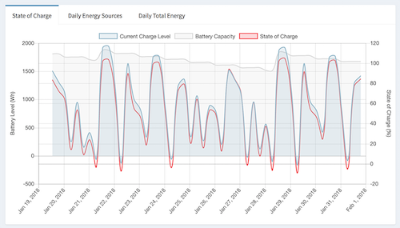
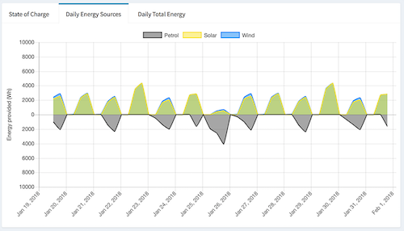
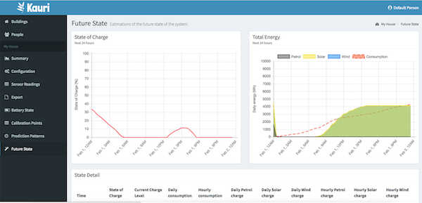
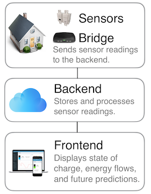

  

## What is this?
Kauri is a cloud based system for monitoring your off-grid energy systems. It consists of several components including the software which interacts with your energy sensors, the server that collects and processes your data, and the frontend which lets you view all your data from any internet connected device.

### Features
* Collect data from energy sensors on-site and store them in the cloud. This means you can access your sensor data from anywhere in the world!

* Calculate the state of charge of the battery using the [B42SOC algorithm](resources/about-b42soc.md). This lets you better plan when you need to use a generator. Kauri also provides a full history of the state of your system to track trends over time.

* Get information about the energy provided from each of your [energy sources](docs/energy-sources.md). This means you can identify exactly how much energy your solar generation provides in comparison to wind, etc.

* Get information about the consumption of the building.

* Predicts the future state of the system using historical data through [several methods of prediction patterns](docs/future-state.md).

* View the live status of the energy system, including the current energy flows, state of charge and future state of the system.

* Highly configurable - tweak everything from the low voltage trigger time to the colour of your solar generation in graphs.

* Support for as many buildings as you need on a single Kauri server.

* Support for multiple bridge clients per building.

* Full user management - users can create accounts for others and give others access to their buildings.

### Components of Kauri

## [What do I need?](docs/what-do-i-need.md)
There are quite a few moving parts involved in Kauri. Before you get started, be sure to check you have everything you need.

**If you just want to have a play with Kauri for now, there are options to work with example datasets and on your local system, so keep reading!**

## [Setting up](docs/setting-up.md)
See the setting up guide for information on how to get Kauri running in your development or production environment.

## [Getting started](docs/getting-started.md)
See the getting started guide to learn how Kauri works and get Kauri collecting, processing and predicting the future using your data.

## API Documentation
When you have an instance of the API running you can access the StrongLoop API Explorer at `http://localhost:3000/explorer` to experiment with the API.
## Contributing
I am not actively developing this project but if you find a bug or anything that could make the system better, please raise an issue on GitHub.

Even better, if you have a chance, feel free to fork the repository, make your change and open a merge request to have it merged in.

## Licence
[MIT](LICENSE)
